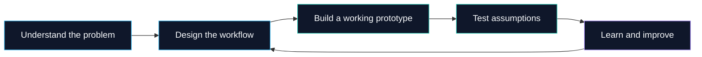

<h1 align="center">Hi 👋, I'm Veenit</h1>

<h3 align="center">Practical AI. Thoughtful products. Working systems.</h3>

  I build AI-assisted tools and full-stack products that turn real problems into working demos. 
  From disaster operations to sustainability — with humans in control and decisions you can trace.

  

  
  
  

  
  

  <a href="#about-me">About</a> ·
  <a href="#featured-builds">Featured builds</a> ·
  <a href="#toolbox">Toolbox</a> ·
  <a href="#github-in-motion">Activity</a> ·
  <a href="#lets-connect">Connect</a>

---

## About me

- **I build:** AI-assisted products, operational tools, and hackathon prototypes — from idea to demo.
- **I work across:** product design, backend systems, data workflows, and frontend experiences.
- **I care about:** explainability, testing, privacy, and being clear about what a system can and cannot do.
- **I'm exploring:** AI agents, RAG, sustainability technology, emergency operations, and developer tooling.

## Featured builds

<table>
<tr>
<td width="50%" valign="top">
<h3>🚨 DRISHTI / RescueOps</h3>

<b>From field evidence to accountable action.</b>

A human-supervised disaster-operations platform for reviewing incomplete evidence, identifying coverage gaps, and coordinating commander-approved missions.

Evidence review · Route and capability constraints · Offline reconciliation · Audit trails

<a href="https://github.com/veenit-cell/DRISHTI"><b>Explore DRISHTI →</b></a>

</td>
<td width="50%" valign="top">
<h3>🌱 CarbonLoop</h3>

<b>Make everyday climate action measurable.</b>

A gamified sustainability platform with low-carbon missions, progress tracking, leaderboards, and rewards — powered by a deterministic, versioned carbon engine.

Official calculations do not use an LLM. Demo activity data and rewards are synthetic or mocked.

<a href="https://github.com/veenit-cell/CARBON-LOOP-FINAL"><b>Explore CarbonLoop →</b></a>

</td>
</tr>
</table>

## More experiments, more learning

| Project | What I'm exploring |
| :--- | :--- |
| 🧠 [Synthesia](https://github.com/veenit-cell/synthesia) | An emergent knowledge ecosystem built with Python. |
| 📄 [AI Resume Builder](https://github.com/veenit-cell/ai-resume-builder) | ATS-focused resumes with live editing, templates, and AI optimization. |
| 🤝 [Autonomous Social Response Network](https://github.com/veenit-cell/Solution-challenge) | An AI-powered concept for identifying emerging social needs and coordinating volunteers. |
| 💬 [Tempo Group Maker](https://github.com/veenit-cell/tempo-group-maker) | Temporary group messaging and time-bound conversations. |
| 🧬 [Cancer Detection](https://github.com/veenit-cell/Cancer-Detection) | Machine-learning experiments on colorectal cancer detection from gut-microbiome DNA sequencing. |
| 📊 [Portfolio](https://github.com/veenit-cell/Portfolio) | My personal portfolio and web experiments. |

## How I approach a build

## Toolbox

  

| Area | Tools and technologies |
| :--- | :--- |
| **Languages** | Python · TypeScript · JavaScript · SQL · C++ |
| **Frontend** | React · Next.js · Vite · Tailwind CSS |
| **Backend & data** | FastAPI · Node.js · PostgreSQL · PostGIS · Supabase · Redis |
| **AI & data science** | RAG · AI agents · Scikit-learn · Sentence Transformers · FAISS · Graph workflows |
| **Testing & delivery** | Docker · GitHub Actions · Playwright · Vitest · pytest |
| **Analytics & prototypes** | Power BI · Streamlit |

## GitHub in motion

  
  

  

  

Language charts reflect repository code, not proficiency. Activity cards are supplied by external services and may occasionally be unavailable.

## Let's connect

Interested in practical AI, full-stack products, or building a hackathon idea into something usable? Let's talk.

**[LinkedIn](https://www.linkedin.com/in/veenit-ramteke)** · **[Email](mailto:veenitramteke@gmail.com)** · **[Explore my repositories](https://github.com/veenit-cell?tab=repositories)**

---

<i>Build something useful. Test it honestly. Keep improving.</i>

