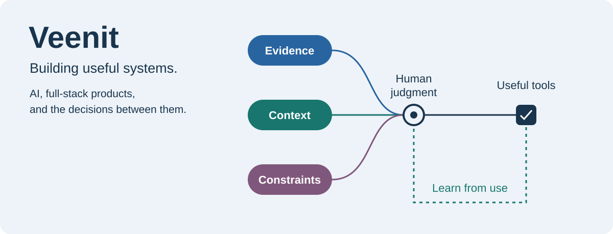

# Hi, I'm Veenit

I build AI-assisted products and full-stack tools, from an early idea to a
working demo. My interests meet where software supports real decisions:
coordinating a response, measuring an activity, or making information usable.

[Explore my projects](https://github.com/veenit-cell?tab=repositories) / [LinkedIn](https://www.linkedin.com/in/veenit-ramteke) / [Email me](mailto:veenitramteke@gmail.com)

## What I'm building

### [DRISHTI / RescueOps](https://github.com/veenit-cell/DRISHTI)

**Helping commanders act on incomplete field evidence.**

A human-supervised disaster-operations platform that brings evidence review,
coverage gaps, route constraints, and team capabilities into mission planning.
Actions stay commander-approved, with offline reconciliation and audit trails
that keep decisions traceable.

### [CarbonLoop](https://github.com/veenit-cell/CARBON-LOOP-FINAL)

**Turning low-carbon activities into measurable progress.**

A sustainability platform with missions, leaderboards, and rewards. Its MVP
uses a deterministic, versioned carbon engine for official calculations.
Demo activity data and rewards are explicitly synthetic or mocked.

## On my workbench

| Project | Focus |
| :--- | :--- |
| [Synthesia](https://github.com/veenit-cell/synthesia) | An emergent knowledge ecosystem in Python. |
| [AI Resume Builder](https://github.com/veenit-cell/ai-resume-builder) | ATS-focused resumes with live editing, templates, and AI optimization. |
| [Autonomous Social Response Network](https://github.com/veenit-cell/Solution-challenge) | A concept for detecting emerging social needs and coordinating volunteers. |
| [Tempo Group Maker](https://github.com/veenit-cell/tempo-group-maker) | Temporary group messaging with time-bound conversations. |
| [Cancer Detection](https://github.com/veenit-cell/Cancer-Detection) | Machine-learning work on colorectal cancer detection from gut-microbiome DNA sequencing. |
| [Portfolio](https://github.com/veenit-cell/Portfolio) | My personal portfolio and web experiments. |

## What guides the work

I enjoy moving between product design, backend systems, data workflows, and
frontend experiences. I care about systems that are explainable, testable,
privacy-conscious, and honest about their limitations.

Currently exploring **AI agents, RAG, sustainability technology, emergency
operations, and developer tooling**.

## Tools I work with

| Area | Tools |
| :--- | :--- |
| Languages | Python, TypeScript, JavaScript, SQL, C++ |
| Frontend | React, Next.js, Vite, Tailwind CSS |
| Backend and data | FastAPI, Node.js, PostgreSQL, PostGIS, Supabase, Redis |
| AI and data science | RAG, AI agents, Scikit-learn, Sentence Transformers, FAISS, graph workflows |
| Testing and delivery | Docker, GitHub Actions, Playwright, Vitest, pytest |
| Analytics and prototypes | Power BI, Streamlit |

## GitHub activity

Statistics, languages, and contribution streak

  

  

  

Language charts reflect repository code, not proficiency. These cards use
external services and may occasionally be unavailable.

## Let's build something useful

Interested in practical AI, full-stack products, or a hackathon idea?
Reach me at **[veenitramteke@gmail.com](mailto:veenitramteke@gmail.com)**
or connect on **[LinkedIn](https://www.linkedin.com/in/veenit-ramteke)**.
